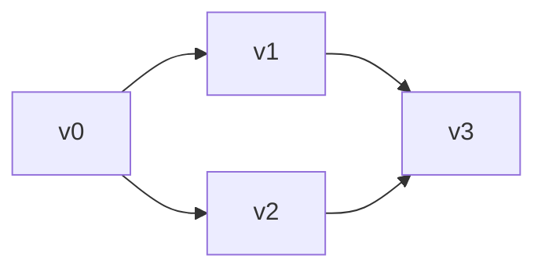

# Notes of GPU Programming

```text
Date : 8 Oct 2026
```
---

## Multi GPU Programming

- Distributed workload (Data Partitioning) btw GPU's.
- We need syncronization btw GPU's.

Let's see an example of SSSP with Multi GPU's.

```pseudo_code
relaxGraph(point P, graph G) {
    foreach (t in P.outneighbors) {
        MIN(t.dist, P.dist + G.weight(P, t))
    }
}

main() {
    Graph hgraph;
    hgraph.addPointProperties(dist, int)
    hgraph.read()
    foreach (t in hgraph.points) t.dist = INF;
    hgraph.dist[src]=0
    while (1) {
        changed = 0;
        foreach (t in hgraph.points) relaxgraph(t, hgraph)
        if (changed == 0) break;
    }
    // print distance
}

MIN (int *addr,int val , int changed){
    if (*addr > val){
        atomicMin(addr, val);
        changed=1;
    }
}
```

> [!Note] `foreach` is a parallelel constructer.

---
>[!QUESTION]
> How do we partition a graph btw multiple GPU's ?

If there exits a node, that is part of two paths, how do we divide it.



Lets say we have 2 GPUs.

Both **GPUs** will have all vertex, but will not have all edges.

Lets say GPU1 has the edges connected with v0,v1 and GPU2 with v2,v3 . All other distance will be set to $\infty$. (It might be subgraphs, in each GPUs.)

After we get the compute individually , then we do a communication btw the two **GPUs**, to get the `min` btw them.


We need not send all the vertexs ,lets say we have 1 million vertex, how do we handle the subgraphs.


> check correctness with a sequential code.
---

>[!NOTE]
Use `cudaSetDevice` to decide which GPU where u want a particular GPU.
By default it's 0.

