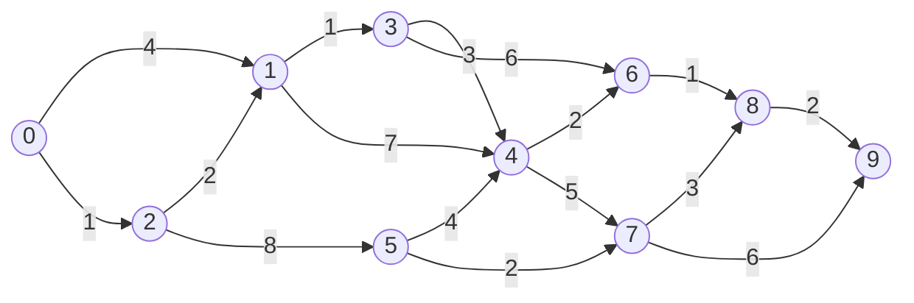

# Tutorial 2

1) Implement SSSP on GPU with graph stored in CSR format.Graph can be read from hard disk to CPU RAM and store it in  CSR format.

**Solution:** [bellman_ford.cu](bellman_ford.cu)

2) Try to implement  a serial algorithm on CPU, check its correctness.

**Solution:** [bellman_ford_serial.cpp](bellman_ford_serial.cpp)

>**Note:** The following graph is used for verify the implementation of SSSP algorithm.

