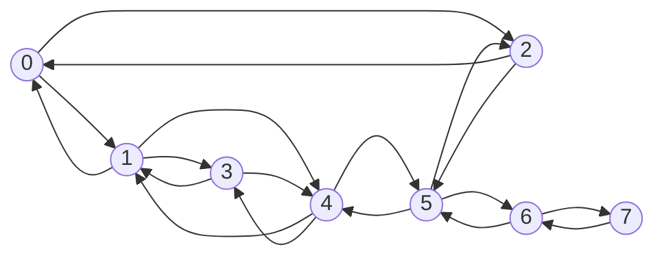

# Tutorial 3

Implement BFS on GPU to find the shortest path in an unweighted graph stored in CSR format. The BFS implementation should be done **without using locks or atomic operations**.

**Solution:** [bfs.cu](bfs.cu)

>[!Note]
 Since the graph is unweighted, BFS can be used to find the shortest distance from a source vertex to every reachable vertex.
>
>The `distance` array is initialized to `-1`, where `-1` indicates that a vertex has not yet been visited.
>
>At each BFS level, only vertices whose distance is equal to the current level are processed. Their unvisited neighbours are assigned a distance of `level + 1`.

The following graph is used to verify the implementation.

